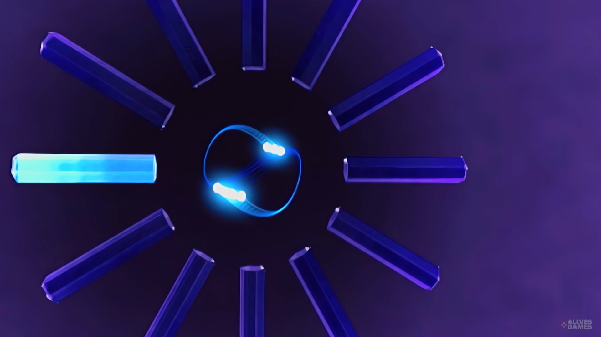
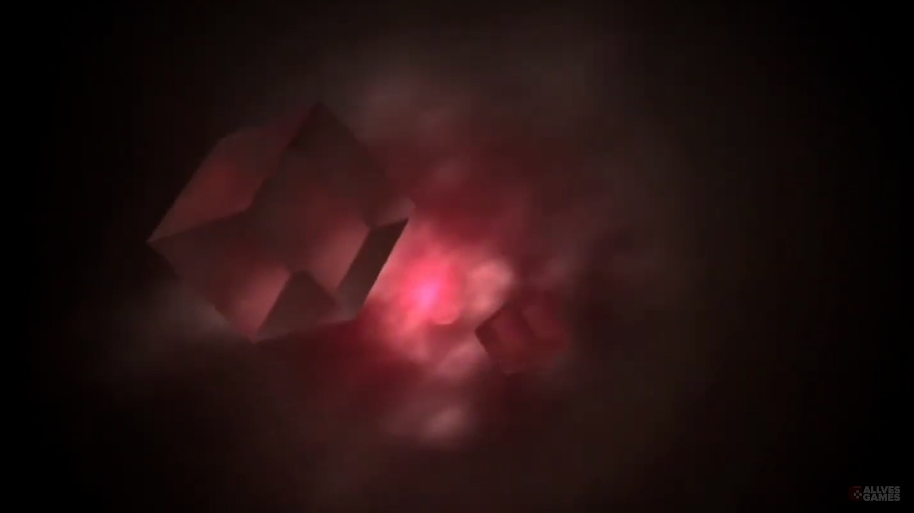
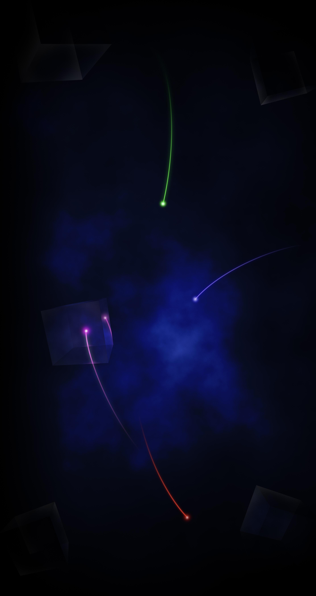

  

<h1 align="center">PS2 Loop Wallpaper Pack</h1>

  A collection of PlayStation 2 inspired wallpapers available as static images and seamless looping videos.

  
  
  

  <a href="https://allvesgames.com">🌐 Website</a> •
  <a href="https://www.youtube.com/@AllvesGames">🎮 YouTube</a> •
  <a href="https://github.com/allvesgames/PS2-Loop-Wallpaper-Pack/releases/latest">📥 Latest Release</a>

---

## 📖 About

**PS2 Loop Wallpaper Pack** is a collection of wallpapers inspired by some of the most recognizable PlayStation 2 screens.

Each collection includes both static images and seamless looping videos, making them suitable for game launchers, emulators, frontends, media centers, desktop customization software, and any application that supports custom image or video backgrounds.

The repository provides both complete package downloads and individual files, allowing you to download only what you need.

---

## 🖼️ Preview

  
  
  

---

## 📦 Included Collections

### 🕒 PS2 Clock

Inspired by the classic PlayStation 2 Clock screen.

**Contents**

- Static Images (.jpg)
- Looping Videos (.mp4)
- Portrait (Vertical)
- Landscape (Horizontal)

---

### 🔴 PS2 RSOD

Inspired by the PlayStation 2 Red Screen of Death.

**Contents**

- Static Images (.jpg)
- Looping Videos (.mp4)
- Portrait (Vertical)
- Landscape (Horizontal)

---

### 🚀 PS2 Startup

Inspired by the classic PlayStation 2 startup screen.

**Contents**

- Static Images (.jpg)
- Looping Videos (.mp4)
- Portrait (Vertical)
- Landscape (Horizontal)

---

## ✨ Features

- 🖼️ JPG image wallpapers
- 🎥 MP4 looping video wallpapers
- 📱 Portrait (Vertical) support
- 🖥️ Landscape (Horizontal) support
- 🔄 Seamless looping videos
- 📦 Complete wallpaper pack (.zip)
- 📥 Individual file downloads
- ⚡ Ready to use

---

## 📥 Downloads

Every release includes:

- 📦 Complete Wallpaper Pack (.zip)
- 🖼️ Individual JPG wallpapers
- 🎥 Individual MP4 looping wallpapers

Download the complete collection or only the files you need.

➡️ **Latest Release**

https://github.com/allvesgames/PS2-Loop-Wallpaper-Pack/releases/latest

---

## 🖥️ Compatibility

These wallpapers can be used with applications that support custom image or video backgrounds, including:

- Game launchers
- Emulators
- Frontends
- Media centers
- Desktop customization software
- Any application supporting image or video wallpapers

---

## 🌐 Links

**Website**

https://allvesgames.com

**YouTube**

https://www.youtube.com/@AllvesGames

If you found this repository useful, consider giving it a ⭐ on GitHub.

---

## 📄 License

This repository is provided free of charge.

You may:

- ✅ Download the complete package
- ✅ Download individual files
- ✅ Use the wallpapers for personal use
- ✅ Share the official GitHub repository or release page

Please do not:

- ❌ Reupload the packaged files to other websites or repositories
- ❌ Redistribute modified packages as official releases

If you'd like to share this project, please link to this GitHub repository or the official website instead.
